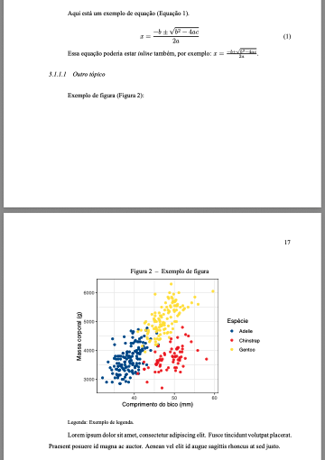

# tese-ufsc

<div style="display: flex; justify-content: center; gap: 20px; width: 100%;">
  
  
</div>
<br>

Um template [Quarto](https://quarto.org/docs/get-started/) para teses e dissertações da UFSC.

Exemplos renderizados [aqui](https://github.com/tamimart/tese-ufsc/_tese).

Capturas de tela do PDF:

<br>
<div style="display: flex; gap: 10px; justify-content: center; flex-wrap: wrap; width: 100%;">
  
  
  
</div>
<br>

Captura de tela do HTML:

<br>
<div style="display: flex; justify-content: center; gap: 20px; width: 100%;">
  
</div>
<br>

## Por que usar Quarto para escrever a monografia?

- 🌎 **Open-source** e multiplataforma: Funciona no Windows, macOS e Linux.
-	📐 Sintaxe simples e **formatação automatizada**: Você escreve em Markdown e o modelo segue as normas.
- 📊 Código e monografia **reprodutível**: Integra análise de dados diretamente no texto.
- 🗂️ Saída em **múltiplos formatos**: PDF e HTML a partir do mesmo arquivo fonte.
-	🔁 **Atualização facilitada**: Separação entre conteúdo e formatação facilita futuras mudanças.

## Requisitos do Sistema

Para utilizar esta extensão, é necessário que seu sistema atenda aos seguintes requisitos:

### Ferramentas principais

- Precisa do [Quarto](https://quarto.org/docs/get-started/) instalado na versão **1.7.31 ou posterior**.
- Precisa de um editor de código com suporte ao Quarto, como:
  - [RStudio](https://posit.co/download/rstudio/)
  - [Positron](https://posit.co/download/positron/)
  - [VS Code](https://code.visualstudio.com/) com a [extensão Quarto](https://marketplace.visualstudio.com/items?itemName=quarto.quarto)

Se não quiser instalar localmente, é possível acessar o Quarto diretamente no navegador através do [Posit Cloud](http://posit.cloud/).

### Dependências adicionais 

- [Pandoc](https://pandoc.org) ≥ 3.6.3 *(já incluso no Quarto)*
- [TinyTeX](https://yihui.org/tinytex/) atualizado (para renderização LaTeX)
    - No terminal:
    
      ```bash
      quarto install tinytex
      ```
      
## Estrutura do template

```r
.
├── LICENSE.md
├── README.md
├── _extensions                    #extensão personalizada com o template UFSC para uso em Quarto; só alterar se souber o que está fazendo ou tiver coragem
│   └── tese-ufsc
│       ├── _extension.yml
│       ├── brasao-UFSC.png
│       ├── capturas
│       │   ├── captura1.png
│       │   ├── captura2.png
│       │   ├── captura3.png
│       │   └── captura4.png
│       ├── logo-quarto.png
│       ├── partials
│       │   ├── before-body.tex
│       │   ├── in-header.tex
│       │   └── toc.tex
│       ├── style.css
│       └── templates
│           └── template-ufsc.docx
├── _quarto.yml                     #configuração principal do projeto - onde você define o título, autor, formatação, etc
├── _tese                           #saída dos arquivos renderizados: tese-ufsc.pdf e index.html
│   ├── imagens
│   ├── index.html
│   ├── search.json
│   ├── site_libs
│   └── tese-ufsc.pdf
├── analises                        #scripts de análise dos dados 
│   └── exemplo.R
├── arquivos-auxiliares             
│   ├── abnt2023.csl                #citação em estilo ABNT 2023
│   ├── pt_BR.aff                   #dicionários de correção ortográfica: Tools > Global Options > Spelling > Add Dictionary
│   ├── pt_BR.dic
│   └── references.bib              #arquivo de referências bibliográficas
├── capitulos                       #arquivos qmd, escreva aqui os capítulos da sua tese/dissertação
│   ├── capitulo1.qmd
│   ├── capitulo2-fundamentacao.qmd
│   ├── capitulo2-metodos.qmd
│   └── capitulo2.qmd
├── dados                           #arquivos de dados utilizados nos capítulos
│   └── dados_penguins.xlsx
├── depois-capitulos                #arquivos que ficam após os capítulos, como referências e apêndices/anexos 
│   ├── anexo-a.qmd
│   ├── apendice-a.qmd
│   └── references.qmd
├── imagens                         #imagens utilizadas no trabalho
│   ├── brasao-UFSC.png
│   ├── favicon.ico
│   └── ficha-catalografica.png
├── index.qmd                       #arquivo principal do projeto, onde fica a introdução e objetivos 
└── tese-ufsc.Rproj
```

## Dicas e comentários

- Você basicamente vai editar os arquivos `.qmd` e `_quarto.yml`.
- O template já vem com dois exemplos de como organizar capítulos.
- A introdução fica no index.qmd, primeiro capítulo após sumários.
- **Atenção**: o arquivo capitulo1.qmd contém exemplos de código em R e Python (relacionados a figuras e tabelas). Se você não utiliza essas linguagens ou não tem instalados no seu sistema, é recomendável remover os blocos de código {r} e {python}, ou substituí-los por código na linguagem que você utiliza (por exemplo, Julia).

## Instalando o template

No terminal do seu editor de código:
```bash
quarto use template tamimart/tese-ufsc
```
Isso instalará a extensão, criando a estrutura do projeto. Se você está acostumada a trabalhar com o RStudio, recomendo que crie um novo projeto nessa mesma pasta.

Se o projeto em Quarto já existir:
```bash
quarto install extension tamimart/tese-ufsc
```

## Renderizando o documento

Para apenas visualizar o HTML, você pode usar o terminal com o seguinte comando do Quarto:

```bash
quarto preview
```

Para renderizar sua tese/dissertação em PDF e HTML:
```bash
quarto render
```

Ou, se quiser renderizar um formato específico:
```bash  
quarto render --to tese-ufsc-pdf
```

Se estiver usando o Rstudio, você pode clicar no botão "Render Book" em Build, e especificar o formato.

## Citação

Para citar este template, você pode usar a seguinte referência BibTeX:

```{bibTeX}
@online{martins2025,
  author = {Martins, Tamires},
  title = {tese-ufsc: um template {Quarto} para teses e dissertações da UFSC},
  date = {2025-05-29},
  url = {http://github.com/tamimart/tese-ufsc},
  langid = {pt-BR}
}
```
