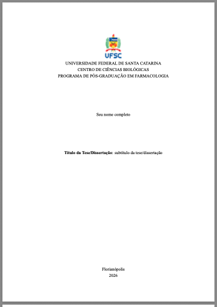

# tese-ufsc

<div style="display: flex; align-items: center; gap: 20px; width: 100%;">
  
  
</div>
<br>
Um template [Quarto](https://quarto.org/docs/get-started/) para teses e dissertações da UFSC.

Exemplos renderizados [aqui](https://github.com/tamimart/tese-ufsc/_tese).

Capturas de tela do pdf:
<br>
<div style="display: flex; gap: 10px; flex-wrap: wrap; width: 100%;">
  
  
  
  
  
</div>
<br>
Capturas de tela do html:
<br>
<div style="display: flex; gap: 10px; flex-wrap: wrap; width: 100%;">
  
  
  
</div>
<br>
## Por que usar Quarto para escrever a monografia?

- **Open-source** e multiplataforma: Funciona no Windows, macOS e Linux.
-	Sintaxe simples e **formatação automatizada**: Você escreve em Markdown e o modelo segue as normas da universidade; sem ajustes manuais e comandos complexos de LaTeX.
- Código e monografia **reprodutível**: Integra análise de dados diretamente no texto.
- Saída em **múltiplos formatos**: PDF e HTML a partir do mesmo arquivo fonte.
-	Atualização facilitada: Separação entre conteúdo e formatação facilita futuras mudanças.

## Requisitos do Sistema

Para utilizar esta extensão, é necessário que seu sistema atenda aos seguintes requisitos:

### Ferramentas principais

- Precisa do [Quarto](https://quarto.org/docs/get-started/) instalado na versão **1.7.31 ou posterior**.
- Precisa de um editor de código com suporte ao Quarto, como:
  - [RStudio](https://posit.co/download/rstudio/)
  - [Positron](https://posit.co/download/positron/)
  - [VS Code](https://code.visualstudio.com/) com a [extensão Quarto](https://marketplace.visualstudio.com/items?itemName=quarto.quarto)

### Dependências adicionais 

- [Pandoc](https://pandoc.org) ≥ 3.6.3 *(já incluso no Quarto)*
- [TinyTeX](https://yihui.org/tinytex/) atualizado (para renderização LaTeX)
    - No terminal:
      ```bash
      quarto install tinytex
      ```
      
## Estrutura do template

```
├── LICENSE.md
├── README.md
├── _extensions
│   └── tese-ufsc                  #extensão personalizada com o template UFSC para uso em Quarto; só alterar se souber o que está fazendo ou tiver coragem
│       ├── _extension.yml
│       ├── brasao-UFSC.png
│       ├── logo-quarto.png
│       ├── partials
│       │   ├── before-body.tex
│       │   ├── in-header.tex
│       │   └── toc.tex
│       └── templates
│           └── template-ufsc.docx
├── _quarto.yml                    #configuração principal do projeto - onde você define o título, autor, formatação, etc
├── _tese                          #saída dos arquivos renderizados: tese-ufsc.pdf e index.html
│   ├── capitulos                  
│   │   ├── capitulo1.html
│   │   └── capitulo2.html
│   ├── depois-capitulos
│   │   ├── apendice-a.html
│   │   └── references.html
│   ├── index.html
│   ├── search.json
│   ├── site_libs
│   └── tese-ufsc.pdf
├── analises                        #scripts de análise dos dados 
│   └── exemplo.R
├── arquivos-auxiliares             #arquivos auxiliares, como bibliografia, citação em ABNT e dicionários de correção ortográfica
│   ├── abnt2023.csl
│   ├── pt_BR.aff
│   ├── pt_BR.dic
│   └── references.bib
├── capitulos                       #arquivos qmd, escreva aqui os capítulos da sua tese/dissertação
│   ├── capitulo1.qmd
│   ├── capitulo2-fundamentacao.qmd
│   ├── capitulo2-metodos.qmd
│   └── capitulo2.qmd
├── dados                           #arquivos de dados utilizados nos capítulos
│   └── dados_penguins.xlsx
├── depois-capitulos                #arquivos que ficam após os capítulos, como referências e apêndices/anexos 
│   ├── apendice-a.qmd
│   ├── default.html
│   ├── references.qmd
│   └── tese-ufsc.html
├── imagens                         #imagens utilizadas nos capítulos
│   └── ficha-catalografica.png
├── index.qmd                       #arquivo principal do projeto, com a introdução e objetivos
└── tese-ufsc.Rproj
```

## Dicas e comentários

- Você basicamente vai editar os arquivos `.qmd` e `_quarto.yml`.
- O template já vem com dois exemplos de como organizar capítulos.
- A introdução fica no index.qmd, primeiro capítulo após sumários.

## Instalando o template

No terminal do seu editor de código:
```bash
quarto use template tamimart/tese-ufsc
```
Isso instalará a extensão, criando a estrutura do projeto. Se você está acostumada a trabalhar com o RStudio, recomendo que crie um novo projeto nessa mesma pasta.

Se o projeto em Quarto já existir:
```bash
quarto install extension tamimart/tese-ufsc
```

## Renderizando o documento

Para apenas visualizar o html, você pode usar o terminal com o seguinte comando do Quarto:

```bash
quarto preview
```

Para renderizar sua tese/dissertação em PDF e html:
```bash
quarto render
```

Ou, se quiser renderizar um formato específico:
```bash  
quarto render --to tese-ufsc-pdf
```

Se estiver usando o Rstudio, você pode clicar no botão "Render Book" em Build, e especificar o formato.

## Atenção - capitulo1 tem código de R e python

Usuários de Julia: Após instalar a extensão, procure por {r} e {python} no arquivo capitulos/capitulo1.qmd e remova o código (relacionado a figura e tabela) ou substitua por código em Julia.

## Citação

Para citar este template, você pode usar a seguinte referência BibTeX:

```{bibTeX}
@online{martins2025,
  author = {Martins, Tamires},
  title = {tese-ufsc: um template {Quarto} para teses e dissertações da UFSC},
  date = {2025-05-29},
  url = {http://github.com/tamimart/tese-ufsc},
  langid = {pt-BR}
}
```
